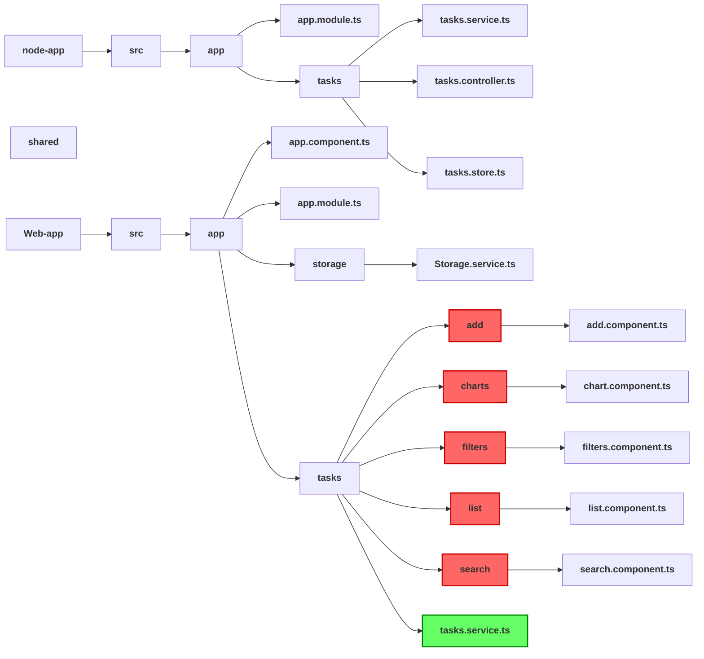

# User Task App - Angular Project

## Introduction

This app practice focuses on enhancing a minimal client application by incorporating new features, refining the user experience, and improving reliability. Built with the same tools and technologies our engineers use daily, this practice provides hands-on experience with the tech stack. There's no need to build a backend API—just focus on improving the frontend application.

## Functional Features

### 1. **Add**
   - Users can add tasks to their list.

### 2. **Filter**
   - Filter tasks by `Not Completed`.
   - Filter tasks by `High Priority`.
   - Filter tasks by `Due Today`.

### 3. **Simple Search**
   - Search for tasks that contain the search term in their **title**.
   - Clearing the search reloads all tasks.
   - Maintains the sequence of search and filter operations.

### 4. **Add Date Picker**
   - Allows users to set a scheduled date using a date picker.
   - Users can only select a date within the next **7 days**.
   - Includes test coverage for this feature.

### 5. **Fuzzy Search**
   - Enhances simple search with fuzzy search capabilities.
   - Includes test coverage for this feature.
   - Allows the use of an npm package (e.g., `fuse.js`) to implement fuzzy search.
   - Example: Searching for _hoem_ should return tasks that include _home_ in the title.

### 6. **Dashboard Panel**
   - Provides a visual summary of tasks, including:
     - Count of tasks by priority.
     - Percentage of completed tasks.


## Getting started

1. Install dependencies
```bash
npm install
```
2. Start the Servers: run the backend server and the frontend server
```bash
npx nx run node-app:serve 
npx nx run web-app:serve
```
3. Once the servers are running, open your browser and navigate to: `http://localhost:4200/`

4. The app includes unit tests for existing features. To execute them, use:
```bash
npx nx run node-app:test 
npx nx run web-app:test
```
--- 
## Flowchart of the application

## Angular Learning Summary

✅ **TypeScript-based Framework**
- **Component-based Architecture**
- **Hierarchical Dependency Injection**
  - Angular uses a hierarchical dependency injection system to manage services and dependencies efficiently.

✅ **Components vs. Modules**
- **Component**: 
  - A reusable UI block with a class (logic), template (view), and metadata (e.g., @Component).
- **Module (NgModule)**: 
  - A container grouping components, directives, services, and routes (e.g., @NgModule).

✅ **Angular Lifecycle Hooks**
- **Lifecycle hooks**: 
  - Tap into key moments in a component’s life:
    - **ngOnInit**: Initialize data.
    - **ngSubmit**: Respond to changes.

✅ **RxJS** (Reactive Extensions for JavaScript)
- **Library for reactive programming using observables**
- **Observables and Observers**:
  - **Observable**: Stream of data that can emit multiple values over time.
  - **In this app**: 
    - `import { Observable, of, take, debounceTime, distinctUntilChanged } from 'rxjs';`

✅ **Data Bindings**
- **Data binding synchronizes component data with the view**:
  - **Interpolation**: `{{ value }}` (displays values).
  - **Property Binding**: `[property]="value"` (sets element properties).
  - **Event Binding**: `(event)="handler()` (responds to DOM events).
  - **Two-Way Binding**: `[(ngModel)]="property"` (combines property and event binding).
  - **Class/Style Binding**: `[class.active]="condition"`, `[style.color]="color"`.