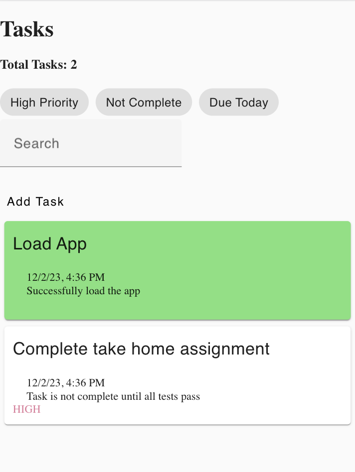
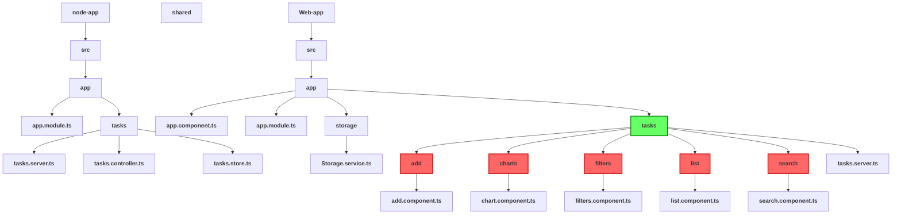

# Technician's Tasks - Take Home Assignment

## Introduction

In this assignment, you will be tasked in updating the _very_ barebones client application by adding features requested by our customers. To get you comfortable with our tech stack, the application is built with tools and technologies our engineers work with on a daily basis. You are not required to build the backend API, your task is to improve the client application by adding features, updating the UX and improving the reliability.

## Task

Your task is to update / add the requested features. Specifically:

1. **Add**

   Users aren't able to add tasks to their list

   - User should navigate to a form when clicking `Add Task`
   - Form should only allow tasks to be created which have a title of **at least 10 characters**
   - Added task should be included in the task list
   - User should be navigated back home if adding or canceling the form.

2. **Filter**

   Users can only filter the list for `Not Completed` tasks

   - Add filtering for `High Priority` tasks
   - Add filtering for `Due Today` tasks

3. **Simple Search**

   Users can't search for tasks based on title

   - Implement a simple search that searches for all tasks that contain the search term in it's **title**
   - Clearing the search should reload all tasks

4. **Add Date Picker (Optional)**

   Users can't set the scheduled date when creating a task

   - Add a date picker to allow user to set the scheduled date
   - User can only select a date within the next **7 days**
   - Add test coverage for this new feature

5. **Fuzzy Search (Optional)**

   Users aren't good at spelling when searching for tasks

   - Upgrade our simple search implementation to fuzzy search
   - Add test coverage for this new feature
   - You are allowed to use an npm package to help implement this feature such as fuse.js
   - e.g. searching with value _hoem_ should return tasks that include _home_ in title

6. **UX Improvements (Optional)**

   Users aren't excited using our application

   - Implement any UX improvements (e.g. styles, animations, alerts)
   - Add test coverage for this new features
   - Don't be shy to use icons and colors
   - Simplicity is the ultimate sophistication - Steve Jobs

## Getting started

You should start by installing the dependencies via npm by running `npm install` from the root folder.

The repository contains a backend server application, `packages/node-app`, a front-end web application `packages/web-app`, and a shared library `packages/shared`. All these apps and libraries are managed by [Nx](https://nx.dev/), a build system for monorepos.

You can serve the backend and frontend apps by running `npx nx run node-app:serve` and `npx nx run web-app:serve` respectively. Once the two apps are running, you should see the following page if you navigate to `localhost:4200` in a browser.

Each application also includes unit test suites than can be run with `npx nx run node-app:test` and `npx nx run web-app:test`. The test suites are written with the [Jest testing framework](https://jestjs.io/).

> [!NOTE]
> You will notice there are many failing tests. We encourage developers to adopt a TDD approach to development. You should implement the features to get these tests to pass.

> [!TIP]
> There are TODO comments sprinkled throughout the codebase to help guide you through your implementation.

### Evaluation criteria

Your assignment will be evaluated based on the following factors in order of priority:

- **Functionality:** Does the application meet the specified requirements? Are the requested features implemented correctly?
- **Code Quality:** Is your code well-structured, modular, and following best practices for [Angular development](https://angular.io/guide/styleguide)?
- **Testing:** Do you have appropriate unit tests to validate the functionality of the features?
- **Extra Mile:** Did you attempt any of the optional tasks?

### Submission

Please submit your assignment by providing a link to your version-controlled repository (e.g., GitHub) containing your codebase and the link to your app.
Add takehome@scription.ai as a collaborator to your repository.

Feel free to reach out if you have any questions during the assignment period.
Good luck, and we look forward to reviewing your submission!

--- 
## Flowchart of the application
